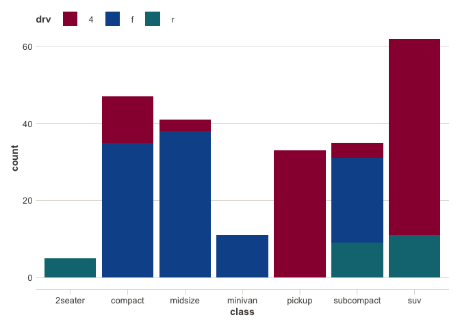

<!-- README.md is generated from README.Rmd. Please edit that file -->

# ftplottools

<!-- badges: start -->
<!-- badges: end -->

ftplottools is a ggplot2 theme made to match the style and colours of
charts created by the Financial Times (FT). The package is built and
maintained by FT staff members.

## Installation

If you are an FT employee, you can download ftplottools from our own
internal R package repository (FTRAN):

``` r
install.packages("ftplottools", repos = "https://financial-times.github.io/FTRAN/")
```

If you are not an FT employee, you can download the development version
from [GitHub](https://github.com/) with:

``` r
# install.packages("devtools")
devtools::install_github("Financial-Times/ftplottools")
```

## Example

The following example shows how to apply the FT theme to your ggplot2
object. The various theme elements can be applied by adding `ft_theme()`
to your plot. Colour scales can be applied by adding `scale_color_ft()`
or `scale_fill_ft()`.

``` r
library(ftplottools)
library(ggplot2)

ggplot(mpg, aes(displ, hwy, colour = class)) + 
  geom_point() +
  ft_theme() +
  scale_color_ft()
```

 If you want
to be more specific about the FT colours you choose, you can pick them
directly using `ft_colors()`:

``` r
ggplot(mpg, aes(class, fill = drv)) +
  geom_bar() +
  ft_theme() +
  scale_fill_manual(values = ft_colors("claret", "oxford", "teal"))
```



To see a full list of the available colours along with their labels,
call `ft_colors()` (without any arguments).

``` r
head(ft_colors(), 10)
#>     paper     black     white    claret    oxford      teal     wheat       sky 
#> "#FFF1E5" "#000000" "#FFFFFF" "#990F3D" "#0F5499" "#0D7680" "#F2DFCE" "#CCE6FF" 
#>     slate    velvet 
#> "#262A33" "#593380"
```
